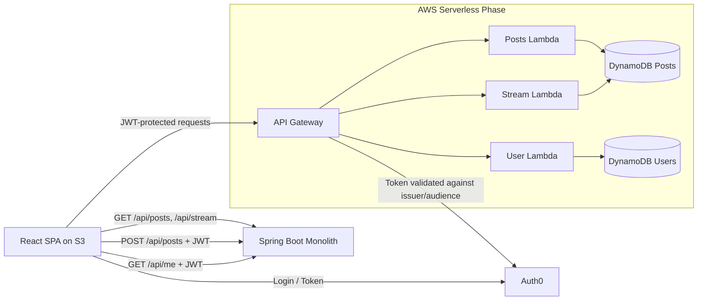

# TDSE Microservicios - Assignment EXPERIMENTAL

Building a Secure Twitter-like Application with Microservices and Auth0.

## 1. Project Overview

This repository implements the full laboratory in two evolution stages:

1. Spring Boot Monolith (secure REST API + Swagger/OpenAPI)
2. Serverless Microservices on AWS Lambda (User, Posts, Stream)

The frontend is a React SPA integrated with Auth0 and deployable to Amazon S3 as a static website.

## 2. Repository Structure

```
.
├── monolith/                 # Spring Boot monolith (Auth0-protected API + Swagger)
├── frontend/                 # React SPA using Auth0 React SDK
├── microservices/            # AWS Lambda-based microservices + SAM template
└── README.md
```

## 3. Architecture Evolution

### 3.1 Monolith phase

- Backend: Spring Boot (`monolith`)
- Security: OAuth2 Resource Server + JWT validation against Auth0 issuer + audience check
- Public endpoints:
	- `GET /api/posts`
	- `GET /api/stream`
- Protected endpoints:
	- `POST /api/posts` (requires `write:posts`)
	- `GET /api/me` (requires `read:profile`)

### 3.2 Microservices phase

- `user-service` (Lambda): `GET /me` protected with Auth0 token (`read:profile`)
- `posts-service` (Lambda): `POST /posts` protected with Auth0 token (`write:posts`)
- `stream-service` (Lambda): `GET /stream` public endpoint
- Data storage: DynamoDB (posts table + users table)
- Exposure: API Gateway (HTTP API)

## 4. Architecture Diagram



## 5. Auth0 Configuration

Create in Auth0:

1. SPA Application (for React frontend)
2. API Application with unique Audience (for backend/resource servers)

Recommended API scopes:

- `read:posts`
- `write:posts`
- `read:profile`

Set frontend callback/logout/web origins to your local URL and S3 URL.

## 6. Monolith (Spring Boot) Setup

Path: `monolith`

### 6.1 Environment variables

Use these environment variables before running:

- `AUTH0_ISSUER_URI=https://YOUR-DOMAIN.auth0.com/`
- `AUTH0_AUDIENCE=https://api.tdse-twitterlike`

### 6.2 Run locally

```bash
cd monolith
mvn spring-boot:run
```

### 6.3 API docs (mandatory deliverable)

Swagger UI:

- `http://localhost:8080/swagger-ui.html`
- or `http://localhost:8080/swagger-ui/index.html`

## 7. Frontend (React + Auth0) Setup

Path: `frontend`

### 7.1 Configure env file

Create `.env` from `.env.example`:

```env
VITE_AUTH0_DOMAIN=YOUR-DOMAIN.auth0.com
VITE_AUTH0_CLIENT_ID=YOUR_SPA_CLIENT_ID
VITE_AUTH0_AUDIENCE=https://api.tdse-twitterlike
VITE_API_BASE_URL=http://localhost:8080
```

### 7.2 Run locally

```bash
cd frontend
npm install
npm run dev
```

### 7.3 Build for deployment

```bash
npm run build
```

Output folder: `frontend/dist`

## 8. Deploy Frontend to Amazon S3

1. Create S3 bucket and enable static website hosting.
2. Upload `frontend/dist/*`.
3. Set bucket policy for public read access.
4. Configure CORS if needed.
5. Update Auth0 allowed origins/callback URLs with S3 website endpoint.

Add your final URL here:

- Live Frontend URL: `REPLACE_WITH_YOUR_S3_URL`

## 9. Microservices on AWS Lambda Setup

Path: `microservices`

### 9.1 Install dependencies

```bash
cd microservices/services/posts-service
npm install
cd ../stream-service
npm install
cd ../user-service
npm install
```

### 9.2 Deploy with AWS SAM

From `microservices` folder:

```bash
sam build
sam deploy --guided
```

Provide parameter values:

- `Auth0IssuerUri`
- `Auth0Audience`

The deployment outputs `ApiBaseUrl` for API Gateway.

## 10. Endpoints Summary

### Monolith endpoints

- Public:
	- `GET /api/posts`
	- `GET /api/stream`
- Protected:
	- `POST /api/posts` (scope: `write:posts`)
	- `GET /api/me` (scope: `read:profile`)

### Microservices endpoints (API Gateway)

- Public:
	- `GET /stream`
- Protected:
	- `POST /posts` (scope: `write:posts`)
	- `GET /me` (scope: `read:profile`)

## 11. Tests Performed

### Monolith tests

Implemented tests cover:

- Public access to `GET /api/posts`
- Authentication required for `POST /api/posts`
- Validation of maximum 140 characters
- Scope enforcement for `GET /api/me`

Executed command:

```bash
cd monolith
mvn test
```

Result: successful execution, no failures.

### Frontend validation

Executed commands:

```bash
cd frontend
npm install
npm run build
```

Result: build generated successfully.

### Microservices validation

Executed syntax validation (`node --check`) for all handlers:

- `posts-service/handler.js`
- `stream-service/handler.js`
- `user-service/handler.js`

Result: all passed.

## 12. Security Notes

- Auth0 is mandatory and implemented in both monolith and Lambda services.
- JWT validation includes issuer and audience checks.
- Scope-based authorization is enforced on protected endpoints.
- No credentials or secrets are committed in this repository.
- Use environment variables and AWS parameterization for sensitive data.

## 13. Required Deliverables Checklist

- [x] Monolith source code (Spring Boot)
- [x] Frontend source code (React + Auth0)
- [x] Microservices source code (AWS Lambda)
- [x] Swagger/OpenAPI documentation in monolith
- [x] Auth0-secured API
- [x] Test report in README
- [ ] Live frontend URL on S3 (`REPLACE_WITH_YOUR_S3_URL`)
- [ ] Swagger deployed URL or screenshot/export attached by team
- [ ] Demo video (5-8 minutes) attached by team

## 14. Suggested Video Demo Script (5-8 min)

1. Show architecture overview (monolith to microservices).
2. Login with Auth0 in frontend.
3. Create a post (protected endpoint).
4. Show public stream.
5. Call and show `/api/me` profile data.
6. Show Swagger UI for monolith.
7. Briefly explain AWS Lambda + API Gateway deployment.

## 15. Branch Note

Git branch created for this work:

- `Feature-Microservicio`

Note: Git branch names with spaces are not recommended; this implementation uses a hyphenated equivalent.


AUTORES
Juan Miguel Rojas
Felipe Calvache
David Eduardo Salamanca
